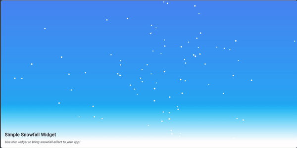

# Simple Snowfall

This Flutter package provides a simple and customizable snowfall animation widget. It's perfect for adding a festive touch to your Flutter applications during the holiday season.

## Features

- Realistic snowfall animation.
- Customizable gravity and wind intensity.
- Easy to integrate into your Flutter app.

## Getting started

To use this package, add `simple_snowfall` as a dependency in your `pubspec.yaml` file.

```yaml
dependencies:
  simple_snowfall: ^1.0.0
```

Then, import the package in your Dart code:

```dart
import 'package:simple_snowfall/snowfall.dart';
```

## Usage

Create a `SnowfallWidget` and place it in your widget tree. You can customize the gravity, wind intensity, and size.

```dart
SnowfallWidget(
  gravity: 0.1,
  windIntensity: 1,
  size: Size(
    MediaQuery.of(context).size.width,
    MediaQuery.of(context).size.height,
  ),
)
```

## Demo



## Contact Information

For any inquiries or feedback, feel free to reach out:

- **LinkedIn**: [Sarthak Parajuli](https://www.linkedin.com/in/sarthakparajuli/)
- **GitHub**: [Sarthak Parajuli](https://github.com/kingace2056)

## Repository

Find the project on GitHub: [Simple Snowfall Repo](https://github.com/kingace2056/simple_snowfall)

## License

This project is licensed under the MIT License - see the [LICENSE](LICENSE) file for details.
